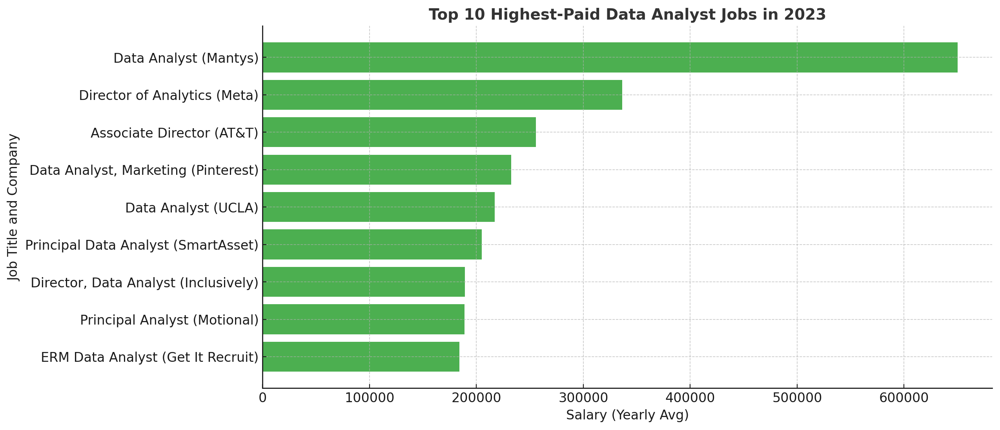
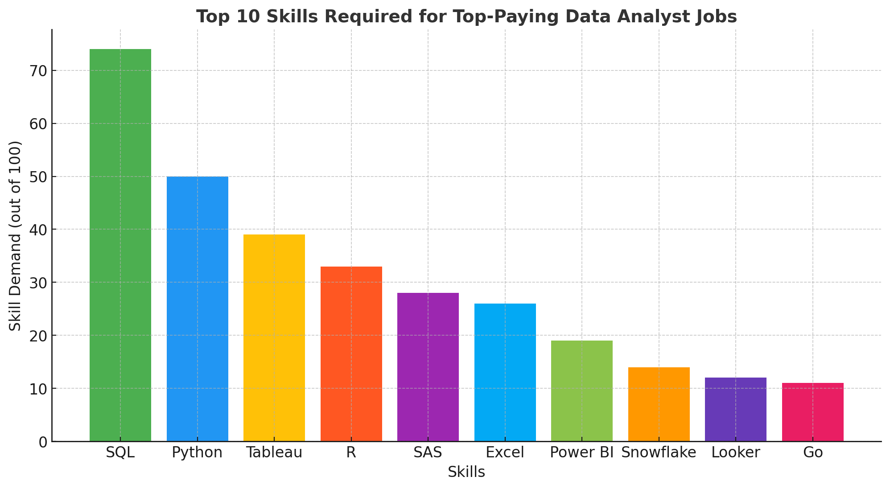
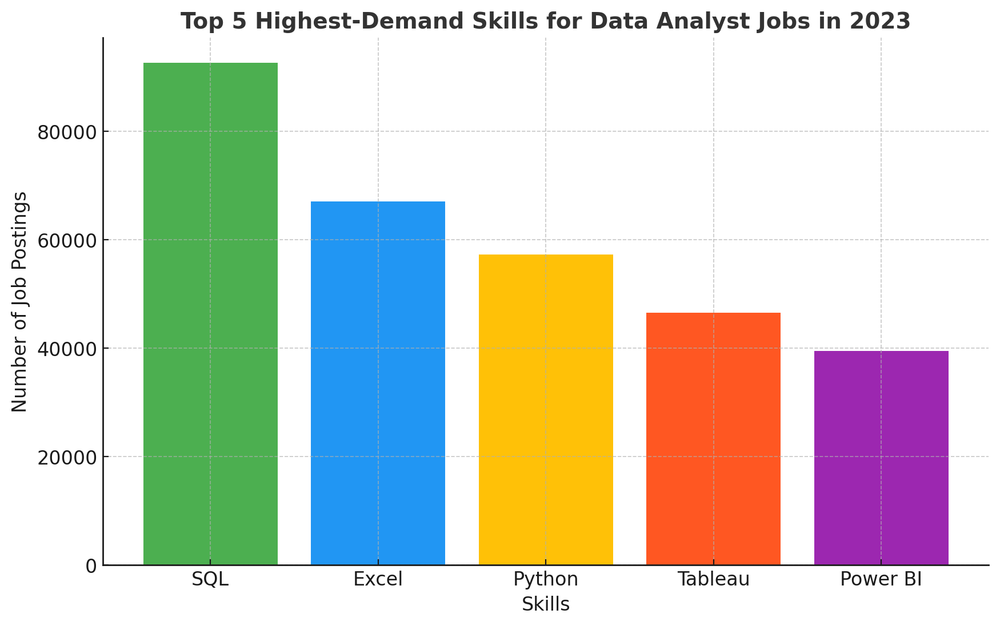
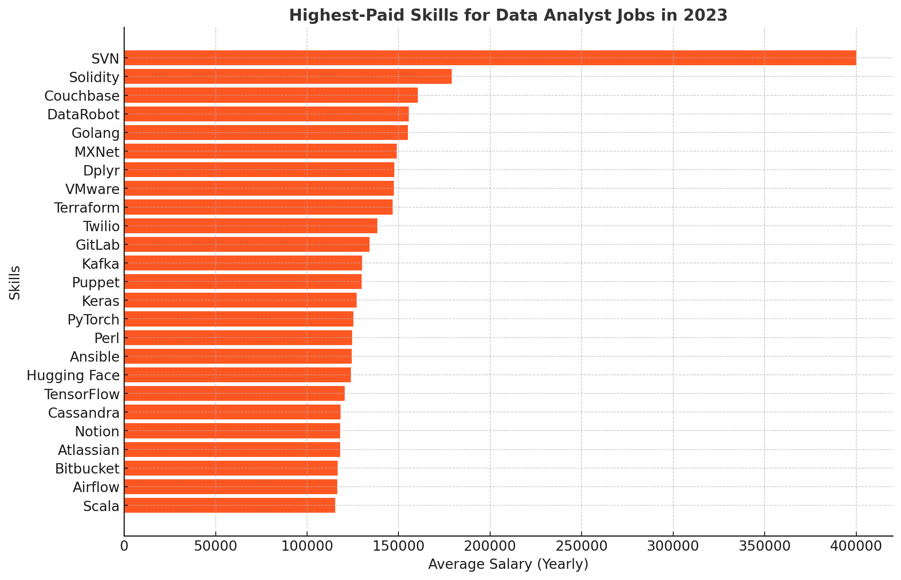
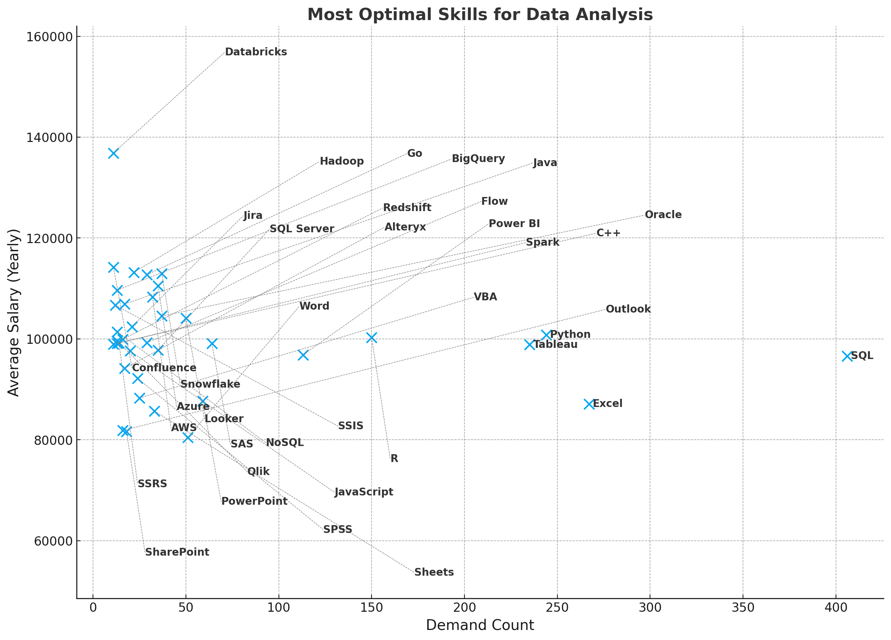

# Introduction
Dive into the data job market! Focusing on data analyst roles, this project explores top-paying jobs, in-demand skills, and where high demand meets high salary in data analytics.

SQL queries? Check them out
here: [project_sql folder](/project_sql/)
# Background
How does one navigate the data-analyst job
market more effectively and efficiently? This project was born from a desire to answer just that question. 

By focusing on the most desirable and suitable jobs, as well as the highest-paid and in-demand skills, this project streamlines the process of finding optimal career opportunities.

Since this project was to primarily develop and display my SQL skills, the data I used was a generic dataset; not one I actually used for my job search. Although, I could certainly employ the skills I learned in this project to search for roles in this way now.

Note: I learnt more SQL concepts in this project like table manipulation (creation, alteration, dropping), order of execution, data types, wildcards, etc., but I left them out for brevity.

### The questions I wanted to answer through my SQL queries were:
1. What are the top-paying data analyst jobs?
2. What skills are required for these top-paying
jobs?
3. What skills are most in demand for data
analysts?
4. Which skills are associated with higher
salaries?
5. What are the most optimal skills to learn?
# Tools I Used
- **SQL**: The backbone of my analysis, allowing me to
query the database to derive insights.
- **PostgreSQL**: The chosen database management
system; ideal for handling the job data.
- **Visual Studio Code**: My go-to for database
management and executing SQL queries.
- **Git & GitHub**: Essential for version control and sharing the project, enabling potential collaboration.
# The Analysis
Each query for this project investigated
specific aspects of the data-analyst job market.
Here's how I approached each question:

### 1. Top Paying Data Analyst Jobs
To identify the highest-paying data analyst roles, I filtered positions by the type of job and location, relevant to me. I then selected the highest-paid jobs to remain in the final output. This query highlights the high-paying opportunities in the
field accessible to me.

```sql
SELECT 
    job_id,
    job_title,
    company_dim.name AS company_name,
    salary_year_avg,
    job_schedule_type,
    job_location
FROM 
    job_postings_fact
LEFT JOIN company_dim ON company_dim.company_id = job_postings_fact.company_id
WHERE
    job_title_short = 'Data Analyst' AND
    salary_year_avg IS NOT NULL AND
    job_location IN ('Anywhere', 'United Kingdom')
ORDER BY
    salary_year_avg DESC
LIMIT 10;
```

Here's the breakdown of the top data analyst jobs
in 2023:
- **Wide Salary Range:** Top 10 paying data
analyst roles span from $184,000 to $650,000,
indicating significant salary potential in the
field.
- **Diverse Employers:** Companies like
SmartAsset, Meta, and AT&T are among those
offering high salaries, showing a broad interest
across different industries.
- **Job Title Variety:** There's a high diversity
in job titles, from Data Analyst to Director of
Analytics, reflecting varied roles and
specializations within data analytics.


*Bar graph visualising the the top 10 highest-paid data analyst jobs*
### 2. Skills for Top Paying Jobs
To understand what skills are required for the
top-paying jobs, I joined the job postings with
the skills data, providing insights into what
employers value for high-compensation roles.

```sql
WITH top_paying_jobs_skills AS ( -- simply joins the job data to the skills data to return the skills associated with each high-paid job
    WITH top_paying_jobs AS ( -- simply utilises the fildings from the first question to return the top 100 highest-paid jobs for data analysts
        SELECT 
            job_id,
            job_title,
            company_dim.name AS company_name,
            salary_year_avg
        FROM 
            job_postings_fact
        LEFT JOIN company_dim ON company_dim.company_id = job_postings_fact.company_id
        WHERE
            job_title_short = 'Data Analyst' AND
            salary_year_avg IS NOT NULL AND
            job_location IN ('Anywhere', 'United Kingdom')
        ORDER BY
            salary_year_avg DESC
        LIMIT 100
) 

    SELECT 
        top_paying_jobs.*,
        skills_dim.skills
    FROM top_paying_jobs
    INNER JOIN skills_job_dim ON skills_job_dim.job_id = top_paying_jobs.job_id
    INNER JOIN skills_dim ON skills_dim.skill_id = skills_job_dim.skill_id
) 

SELECT 
    skills,
    COUNT(job_id) AS skill_demand 
FROM top_paying_jobs_skills
GROUP BY 
    skills
ORDER BY skill_demand DESC
LIMIT 10;
--This final query counts the number of times each skill is required for each of the top 100 highest-paid jobs. The demand for each skill is then returned in descending order.
```

Here's the breakdown of the most demanded skills for the top 100 highest-paying data analyst jobs in 2023:
- **SQL** is leading with a count of 74.
- **Python** follows with a count of 50.
- **Tableau** is also highly sought after, with a count of 39. Other skills like R, SAS, Excel, and Power BI follow closely behind in terms
of demand.


*Bar graph visualising the the top 10 most in-demand skills for the 100 top-paying data analyst jobs*

### 3. In-Demand Skills for Data Analysis
This query is similar to (2) in that it returns the skill demand for data analyst jobs. However, this query focuses on all data analyst jobs; not just those that are high-paid.
```sql
WITH jobs_per_skill_id AS ( -- counts the demand per skill ID, prepared to join skill name
    SELECT 
        skills_job_dim.skill_id,
        COUNT(job_postings_fact.job_id) AS job_count
    FROM skills_job_dim
    INNER JOIN job_postings_fact ON job_postings_fact.job_id = skills_job_dim.job_id
    WHERE 
        job_postings_fact.job_title_short = 'Data Analyst'
    GROUP BY skill_id
)

SELECT --  joins the skill name and returns the top 5 in-demand skills for all data analyst positions
    skills_dim.skills,
    jobs_per_skill_id.job_count
FROM skills_dim
INNER JOIN jobs_per_skill_id ON jobs_per_skill_id.skill_id = skills_dim.skill_id
ORDER BY job_count DESC
LIMIT 5;
```

Here's the breakdown of the most demanded skills for data analysts in 2023:
- SQL and Excel remain fundamental, emphasizing the need for strong foundational skills in data processing and spreadsheet
manipulation.
- Programming and Visualization Tools like Python, Tableau, and Power Bi are essential, indicating the increasing importance of technical skills in data storytelling and decision support.


*Bar graph visualising the the top 5 most in-demand skills for all data analyst jobs*
### 4. Highest-Paid Skills for Data Analysts
```sql
SELECT -- finds the average salary of all the jobs pertaining to each skill to learn the expected return from each particular skill
    skills_dim.skills,
    ROUND(AVG(job_postings_fact.salary_year_avg), 0) AS avg_salary
FROM job_postings_fact
INNER JOIN skills_job_dim ON skills_job_dim.job_id = job_postings_fact.job_id
INNER JOIN skills_dim ON  skills_dim.skill_id = skills_job_dim.skill_id
WHERE 
    job_postings_fact.job_title_short = 'Data Analyst' AND
    job_postings_fact.salary_year_avg IS NOT NULL
GROUP BY
    skills_dim.skills
ORDER BY
    avg_salary DESC
LIMIT 25
```
The results show the highest-paying skills are far from the most generally in demand.
A quick third-party analysis of the results shows us that specialist knowledge, like **big data** and **machine learning** skills appear to be very well-paid, along with 
**software development & deployment** skills, and **cloud computing** expertise.


*Bar graph visualising the the top 25 highest-paid skills for all data analyst jobs*

### 5. Most Optimal Skills for Data Analysts

```sql
-- Please scroll down if you want to see the concise, final code.

-- Using the code from (3), we create a new CTE for demand per skill

WITH skill_demand AS (
    WITH jobs_per_skill_id AS (
        SELECT 
            skills_job_dim.skill_id,
            COUNT(job_postings_fact.job_id) AS job_count
        FROM skills_job_dim
        INNER JOIN job_postings_fact ON job_postings_fact.job_id = skills_job_dim.job_id
        WHERE 
            job_postings_fact.job_title_short = 'Data Analyst'
            AND job_work_from_home = TRUE
            AND salary_year_avg IS NOT NULL
        GROUP BY skill_id
    )

    SELECT 
        skills_dim.skill_id,
        skills_dim.skills,
        jobs_per_skill_id.job_count AS demand_count
    FROM skills_dim
    INNER JOIN jobs_per_skill_id ON jobs_per_skill_id.skill_id = skills_dim.skill_id
),

-- using the code from (4), we create a CTE for the average salary per skill

average_salary AS (
    SELECT 
        skills_dim.skill_id,
        skills_dim.skills,
        ROUND(AVG(job_postings_fact.salary_year_avg), 0) AS avg_salary
    FROM job_postings_fact
    INNER JOIN skills_job_dim ON skills_job_dim.job_id = job_postings_fact.job_id
    INNER JOIN skills_dim ON  skills_dim.skill_id = skills_job_dim.skill_id
    WHERE 
        job_postings_fact.job_title_short = 'Data Analyst'
        AND job_postings_fact.salary_year_avg IS NOT NULL
        AND job_work_from_home = TRUE
    GROUP BY
        skills_dim.skill_id
)

-- we now join the tables from the two previous CTEs to return the skills above a threshold of demand that are ordered in terms of their finacial reward.

SELECT 
    skill_demand.skill_id,
    skill_demand.skills,
    skill_demand.demand_count,
    average_salary.avg_salary
FROM 
    skill_demand
INNER JOIN
    average_salary ON average_salary.skill_id = skill_demand.skill_id
WHERE
    demand_count > 20
ORDER BY
    avg_salary DESC,
    demand_count DESC
LIMIT 100


-- Rewriting the all of this previous code more concisely, with some extra tweaks:


SELECT 
    skills_dim.skill_id, 
    skills_dim.skills,  
    COUNT(job_postings_fact.job_id) AS demand_count,  -- Count the number of jobs (demand) per skill
    ROUND(AVG(job_postings_fact.salary_year_avg), 0) AS avg_salary  -- Calculate the average salary per skill
FROM 
    job_postings_fact
INNER JOIN 
    skills_job_dim ON job_postings_fact.job_id = skills_job_dim.job_id  -- Join to associate jobs with skill IDs
INNER JOIN 
    skills_dim ON skills_job_dim.skill_id = skills_dim.skill_id  -- Join to associate skill IDs with skill names => jobs to skills
WHERE 
    job_postings_fact.job_title_short = 'Data Analyst'  -- Filter for 'Data Analyst' jobs
    AND job_postings_fact.salary_year_avg IS NOT NULL  -- Remove jobs with no salary data
    AND job_postings_fact.job_location IN ('Anywhere', 'United Kingdom')  -- Filter for accessible jobs
GROUP BY 
    skills_dim.skill_id  -- Group by skill ID (and implicitly skill name)
HAVING 
    COUNT(job_postings_fact.job_id) > 10  -- Filter to remove jobs with little demand
ORDER BY 
    avg_salary DESC,  -- Sort by average salary in descending order
    demand_count DESC;  -- Sort by job demand (number of jobs) in descending order, secondarily
```

Derived from the code above, here's an overview of the most optimal skills for Data Analysts in 2023:
- The Importance of Programming Languages: Python and R stand out for their high demand, with demand counts of 244 and 150
respectively. Despite their high demand, their average salaries are around $101,397 for Python and $100,499 for R, indicating that
proficiency in these languages is not only widely demanded but also highly valued.
- Cloud Tools and Technologies: Skills in specialized technologies such as Databricks, Azure, and AWS show significant demand with relatively high average salaries, indicating the growing importance of cloud platforms and big data technologies in data analysis.
- Business Intelligence and Visualization Tools: Tableau and Looker, with demand counts of 235 and 50 respectively, and average
salaries around $98,844 and $104,082, highlight the critical role of data visualization and business intelligence in deriving
actionable insights from data.
- Database Technologies: The demand for skills in traditional and NoSQL databases (Oracle, SQL Server, NoSQL) with average
salaries ranging from $97,786 to $104,534, reflects the enduring need for data storage, retrieval, and management expertise.


*Bar graph visualising the the most optimal skills to leearn as a data analyst*

# What I Learned

This project developed my data-analytical toolkit in the following ways:

**Advanced SQL Proficiency**: This project helped me master the art of complex querying such as the following in isolation or combination: joins, CTEs, subqueries, table manipulation, case expressions, dates, functions, and many more. 

**VSCode Competency**: I now consider myself competent in the major functionalities that it offers. I now have the groundwork knowledge necessary to master the software by challenging myself to progressively learn.

**Database management with pgAdmin**: I am now familiar with database creation and management software, and the complex setup it requires.

**Git & GitHub Familiarity**: This project helped me realise the importance and the power of GitHub in sharing projects and enabling collaboration functionality.

**and much more.**

# Conclusion
### Insights
1. **Top-Paying Data Analyst Jobs**: The
highest-paying jobs for data analysts that allow
remote work offer a wide range of salaries, the
highest at $650,000!
2. **Skills for Top-Paying Jobs**: High-paying
data analyst jobs require advanced proficiency in
SQL, suggesting it's a critical skill for earning
a top salary.
3. **Most In-Demand Skills**; SQL is also the most
demanded skill in the data analyst job market,
thus making it essential for job seekers.
4. **Skills with Higher Salaries**: Specialized
skills, such as SVN and Solidity, are associated
with the highest average salaries, indicating a
premium on niche expertise. 
5. **Optimal Skills for Job Market Value**: SQL
leads in demand and offers for a high average
salary, positioning it as one of the most optimal
skills for data analysts to learn to maximize
their market value.

### Closing Thoughts
This project provides useful insights into the data-analyst job market. The findings from the analyses ultimately serve as an invaluable guide to more efficiently navigating career development.

However, the most important aspect of this project by far are the skills I have honed through many hours of practice on this project. 

These skills will now equip me to take on evermore challenging projects to give me real mastery over data into the future.